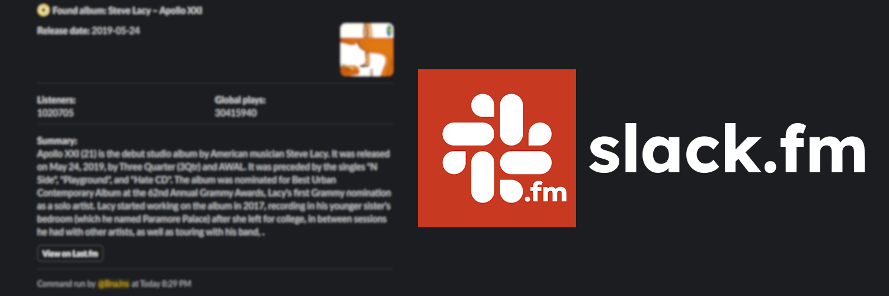
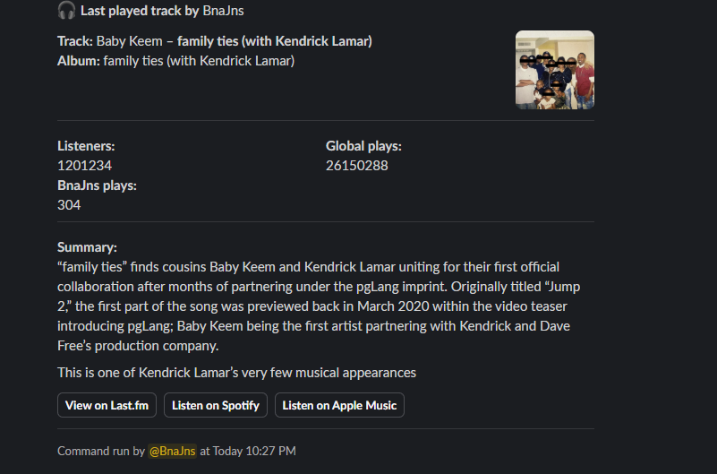

<p align="center">
    
</p>

# slack.fm

A last.fm bot for Slack

[](LICENSE)
[](https://github.com/BananaJeanss/slack.fm/issues)
[](https://github.com/BananaJeanss/slack.fm/stargazers)
[](https://github.com/BananaJeanss/slack.fm/actions/workflows/nest.yml)

## Introduction

**slack.fm** is a Slack bot that lets you connect your Last.fm account to view your music stats, get song/album/artist info, and more, all from within Slack. Perfect for sharing your music taste, discovering new tracks, having fun and competing for crowns.

## Features

- Link your Last.fm account to Slack
- View your or others now playing track, profile, top artists, albums, and songs
- Get fun roasts of your music taste
- See detailed stats for songs, albums, and artists
- View whoknows leaderboards, and compete for crowns
- Easy-to-use Slack slash commands



## Installation

To self-host slack.fm, follow these steps:

1. **Clone the repository:**

   ```bash
   git clone https://github.com/bananajeanss/slack.fm.git
   cd slack.fm
   ```

2. **Install the dependencies:**

   ```bash
   npm install
   ```

3. **Set up your Slack app:**

   - Go to the [Slack API](https://api.slack.com/apps) and create a new app using the slackmanifest.json file.
   - Double-check that everything is set up correctly.

4. **Create a `.env` file**  
   Copy `.env.example` and fill in the required variables.

5. **Run the app:**

   ```bash
   npm start
   ```

## Environment Variables

- `SLACK_CLIENT_ID` – Your Slack app client ID
- `SLACK_CLIENT_SECRET` – Your Slack app client secret
- `SLACK_BOT_TOKEN` – Your Slack bot token (starts with `xoxb-`)
- `SLACK_APP_TOKEN` – Your Slack app-level token (starts with `xapp-`)
- `SLACK_SIGNING_SECRET` – Your Slack signing secret
- `LASTFM_API_KEY` – Your Last.fm API key
- `LASTFM_SHARED_SECRET` – Your Last.fm shared secret
- `LASTFM_CALLBACK_URL` – OAuth callback URL for Last.fm (must be a valid URL)
- `SPOTIFY_CLIENT_ID` – Your Spotify client ID
- `SPOTIFY_CLIENT_SECRET` – Your Spotify client secret
- `USE_LANGUAGE_FILTERING` – `true` or `false` to enable/disable language filtering for output
- `DB_PATH` – Path to the SQLite database file (default: `./utils/slackfm.db`)

## Usage

Once the bot is running and added to your Slack workspace, you can use these basic commands to get started:

| Command          | Description                                  |
| ---------------- | -------------------------------------------- |
| `/link`          | Link your Last.fm account                    |
| `/unlink`        | Unlink your Last.fm account                  |
| `/nowplaying`    | Shows your (or another user’s) current track |
| `/profile`       | Shows Last.fm profile info                   |
| `/artist`        | Shows info about your last played artist     |
| `/album`         | Shows info about your last played album      |
| `/song`          | Shows info about your last played song       |
| `/whoknows`      | Shows top listeners for an artist            |
| `/whoslistening` | Shows who is listening to a track            |
| `/roast`         | Get roasted for your music taste             |

More commands can be found in the [commands.md](commands.md) file.

## Contributing

Contributions are welcome! Please fork the repository and create a pull request. For major changes, open an issue first to discuss what you’d like to change.

For further information on contributing, please refer to the [CONTRIBUTING.md](CONTRIBUTING.md) file.

### Contributors

[](https://github.com/BananaJeanss/slack.fm/graphs/contributors)

## License

This project is licensed under the MIT License. See the [LICENSE](LICENSE) file for details.

## Acknowledgements

- [Last.fm API](https://www.last.fm/api)
- [Slack API/Bolt](https://api.slack.com/bolt)
- [Spotify API](https://developer.spotify.com/documentation/web-api/)
- [SQLite](https://www.sqlite.org/) - Local database storage
- [Express.js](https://expressjs.com/) - Web framework for routing
- [Axios](https://axios-http.com/) - HTTP client for API requests
